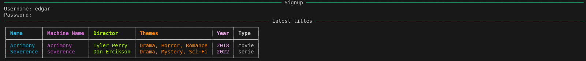
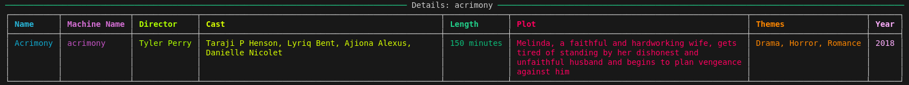
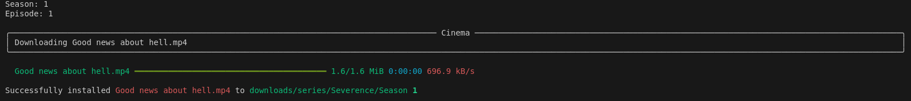

# Cinema
This is a command line tool used to download movies and series from the [Cinema-API](https://github.com/edgarmuyomba/cinemaAPI). It is bundled and distributed using executable files thus easily used by anyone who can operate the terminal without any knowledge of python programming.

## Setup
1. Clone the repo
```bash
git clone <url>
```
2. Create a virtual environment in the base directory
```bash 
python3 -m venv env
```
3. Activate the virtual environment
```bash
env/scripts/activate # for windows
source env/bin/activate # for unix
```
4. Install dependencies
```bash
python3 -m pip install -r requirements.txt
```

## Authentication
All requests made from the cli-tool to the server require token authentication and if the user doesn't have an account or has never been authenticated, they will be required to authenticate themselves in order to access the functionalities


## Operations
### Latest
```bash
cinema latest
```
This command returns a list of the latest 10 titles from the api service.
### Search
```bash
cinema search <query>
```
This returns a list of titles with the required query in their name.

### Details
```bash
cinema details -m <machine_name>
```
Using the `machine_name` of a title, this command returns details about the movie ( using the `-m` flag ) or serie ( using the `-s`flag ) the user is interested in.

### Download
```bash
cinema download -m <machine_name>
```
Still using the `machine_name` of a title, this command downloads the movie or serie episode that the user is interested in.

## Help
For general help about the commands of the tool;
```bash
cinema --help
```
All other commands can have the `--help` or `-h` flag to them in order to get details on how to use them e.g
```bash
cinema download --help
```